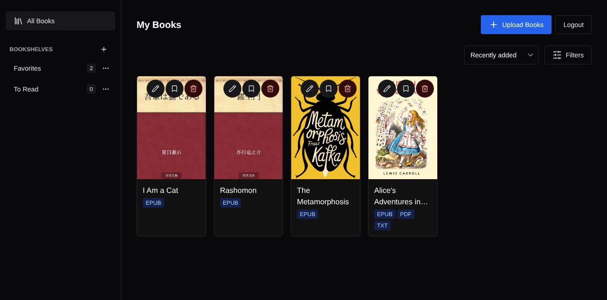
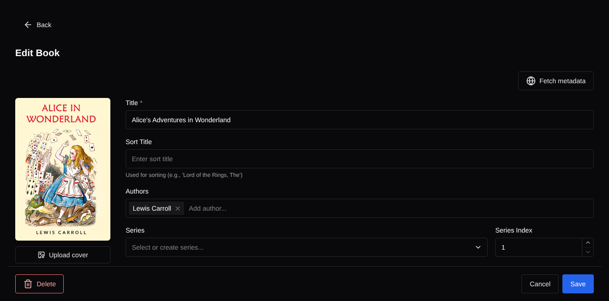
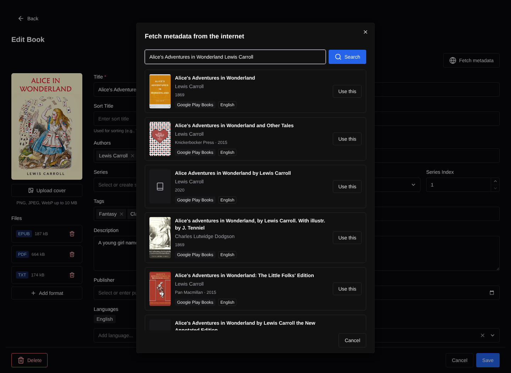
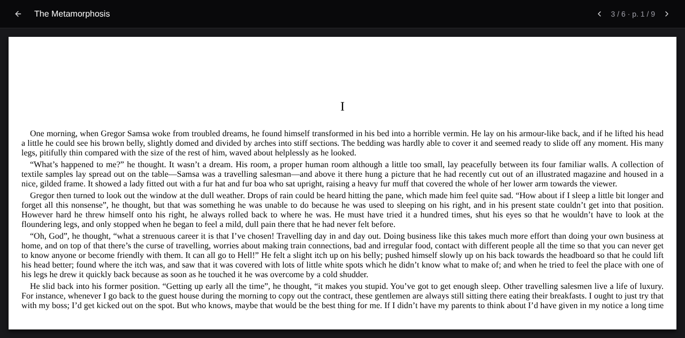

# Calibre-Web Serverless

> [!WARNING]
> This project is under active development and many features are not yet implemented.

A modern, serverless reimplementation of [Calibre-Web](https://github.com/janeczku/calibre-web) built with Next.js and TypeScript.

## Screenshots









## Why Not Calibre-Web?

Calibre-Web does the job well. This project exists because of what running it costs and demands, not because of what it does:

- **The stack has aged** — Python/Flask with server-rendered templates and a jQuery-era frontend, and no static typing to lean on. Reading the code and changing it safely costs more than it should.
- **You pay for an instance around the clock** — tending a library takes a few minutes at a time: upload a book, correct its metadata, send a file to a reader. Because it is not serverless, the instance has to stay up and billing through all the hours in between.
- **TLS on a single instance is awkward** — for one long-lived instance, the major cloud providers offer few managed certificate options. You end up either paying for a load balancer to sit in front of it or renewing certificates yourself.
- **The library sits on ephemeral storage** — a Calibre library on an instance disk has no redundancy and needs a backup story of its own. Pointing it at NFS makes it durable but slow, and a grid of cover images makes that latency impossible to miss.

## Why This Project?

Reading happens on a dedicated e-reader; the web app is only needed for those brief moments in between. A serverless architecture fits that shape:

- **Reduce costs** — Pay only for actual usage, not idle time
- **Ensure reliability** — Leverage managed services (Firebase) for affordable, redundant storage
- **Improve maintainability** — Use static typing with TypeScript for safer code, and leverage a modern tech stack to minimize codebase size
- **Provide a refined UI** — Deliver a modern, polished user experience

## Goals

Achieve feature parity with Calibre-Web while embracing serverless principles and modern web technologies.

## Tech Stack

- **Framework**: Next.js (App Router), React
- **UI**: Chakra UI, Emotion
- **Forms**: react-hook-form
- **Backend**: Firebase (Auth, Firestore, Storage)
- **Language**: TypeScript
- **Testing**: Vitest, Playwright, Storybook
- **Linting/Formatting**: Biome

## Development

`bun run dev` starts Next.js together with the Firebase emulators and seed data.

### Stabilizing the metadata search locally

The "fetch metadata from the internet" feature calls the Google Books API. Without an API key it falls back to the public, IP-rate-limited quota and quickly returns `429`, which makes local verification flaky. For stable local testing, set a Google Books API key in `.envrc.local` (gitignored):

```bash
# .envrc.local
export GOOGLE_BOOKS_API_KEY=your-google-books-api-key
```

`.envrc` sources `.envrc.local` automatically — run `direnv allow` after creating it. The key is only needed locally; deployed environments read it from Secret Manager.

## Roadmap

Shipped:

- [x] Authentication, with password reset
- [x] Library dashboard
- [x] Book upload — several files at once, in a background queue that survives in-app navigation and resumes uploads interrupted mid-transfer
- [x] Multiple file formats per book (EPUB, PDF, MOBI, AZW, AZW3, FB2, TXT)
- [x] Auto-extract metadata from uploaded books (EPUB, PDF)
- [x] Book metadata editor
- [x] Book cover management, including custom cover upload
- [x] Book deletion
- [x] Filter and sort the library by author, series, publisher, tag, language and rating
- [x] Bookshelves (user-created collections)
- [x] Fetch metadata from external sources by title or identifier
- [x] OPDS catalog, authenticated, with per-bookshelf feeds
- [x] Built-in reader for PDF and EPUB, including vertical writing

Planned:

- [ ] Book detail page
- [ ] Book search
- [ ] Reading progress tracking
- [ ] Send-to-Kindle
- [ ] NotebookLM integration
- [ ] ML-based metadata extraction from cover images (fallback)
- [ ] Social login
- [ ] Two-factor authentication
- [ ] Passkey support
